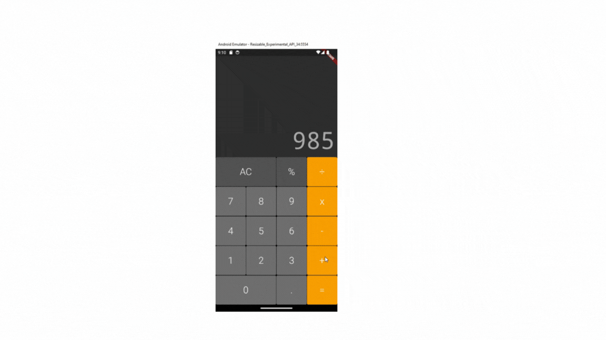

# Calculadora em Flutter/Dart

Uma calculadora simples desenvolvida em Flutter utilizando Dart.

## Funcionalidades

- Adição
- Subtração
- Multiplicação
- Divisão

## Demonstração



## Pré-requisitos

Antes de começar, certifique-se de ter o Flutter instalado e configurado no seu ambiente de desenvolvimento.

Instale as dependências
```bash
flutter pub get
```

## Como Usar
Clone o repositório:
```bash
git clone https://github.com/Sergioadjr/calculadora-flutter.git
```

Navegue até o diretório do projeto:
```bash
cd Desktop
```

Execute o aplicativo:
```bash
flutter run
```